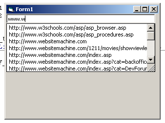

<div align="center">

## Best Auto Complete


</div>

### Description

Creates an Autocomplete drop down box
 
### More Info
 
1 text box


<span>             |<span>
---                |---
**Submitted On**   |
**By**             |[Morpheous](https://github.com/Planet-Source-Code/PSCIndex/blob/master/ByAuthor/morpheous.md)
**Level**          |Beginner
**User Rating**    |4.2 (25 globes from 6 users)
**Compatibility**  |VB 6\.0
**Category**       |[Miscellaneous](https://github.com/Planet-Source-Code/PSCIndex/blob/master/ByCategory/miscellaneous__1-1.md)
**World**          |[Visual Basic](https://github.com/Planet-Source-Code/PSCIndex/blob/master/ByWorld/visual-basic.md)
**Archive File**   |[](https://github.com/Planet-Source-Code/morpheous-best-auto-complete__1-36936/archive/master.zip)


### Source Code

```
'This program needs a textbox ('Text1') on a form
Private Const SHACF_AUTOAPPEND_FORCE_OFF = &H80000000
Private Const SHACF_AUTOAPPEND_FORCE_ON = &H40000000
Private Const SHACF_AUTOSUGGEST_FORCE_OFF = &H20000000
Private Const SHACF_AUTOSUGGEST_FORCE_ON = &H10000000
Private Const SHACF_DEFAULT = &H0
Private Const SHACF_FILESYSTEM = &H1
Private Const SHACF_URLHISTORY = &H2
Private Const SHACF_URLMRU = &H4
Private Const SHACF_USETAB = &H8
Private Const SHACF_URLALL = (SHACF_URLHISTORY Or SHACF_URLMRU)
Private Declare Sub SHAutoComplete Lib "shlwapi.dll" (ByVal hwndEdit As Long, ByVal dwFlags As Long)
Private Sub Form_Load()
 SHAutoComplete Text1.hWnd, SHACF_DEFAULT
End Sub
```

